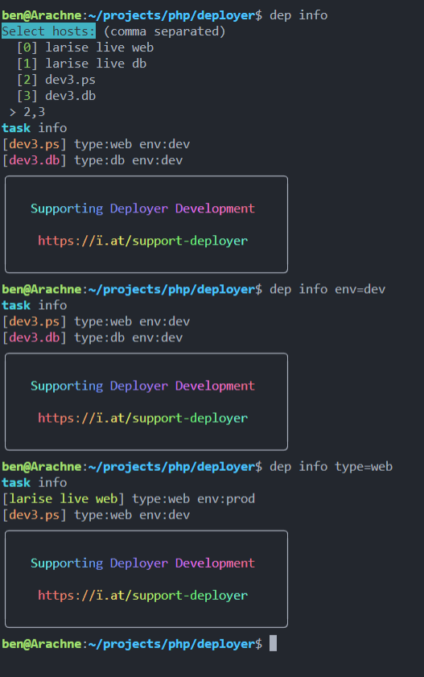

# Deployer Demo-Project

## Installing

* to install deployer in your project, run 
    ```
    composer require --dev deployer/deployer
    ```
*  it is recommended to set an alias for dep, add this to you .bashrc file:
    ```
    alias dep='vendor/bin/dep'
    ```
* there is also bash-completion avaiable, run this to enable it
    ```
    dep completion bash > /etc/bash_completion.d/deployer
    ```

## Recipes


There are already several useful recipes given, amongst others even for PrestaShop:
```vendor/bin/deployer/deployer/recipe/prestashop.php```

## Proposed development workflow

* use a `config/hosts.yml` file to define hosts
* use `~/.ssh/config` (parsed by default) to assign different key files to different customers
* or reference the specific ssh-keyfile like this in the hosts file.yml file:
    ```yaml
    identity_file: ~/.ssh/id_rsa_larise
    ``` 
## Usage:
In deploy.php we include our hostfile like this:
```php
import('config/hosts.yml');
```

and the PrestaShop reciptes like this:
```php
require ('vendor/deployer/deployer/recipe/prestashop.php');
```

and then define our Tasks. 


